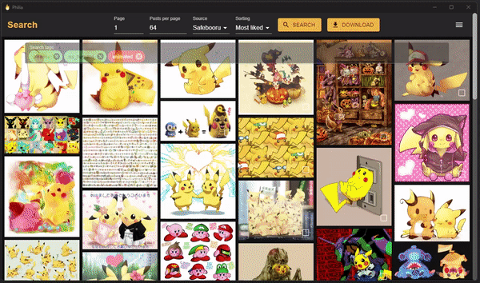
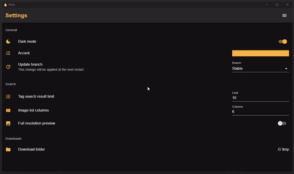
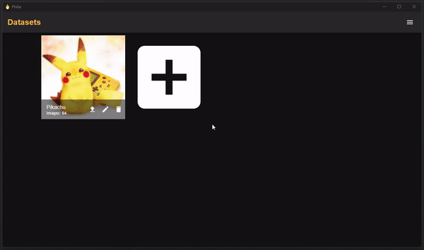

    

<h1 align="center">
    Philia
</h1>

    
    
    
    

Philia is a simple imageboard scraping application with extensive support for AI dataset creation.

## Features

### Search

- Tag auto-completion in the search field.
- Support for many of the most widely used imageboards
- Easily add support for your own imageboards through scripting.

&nbsp;

&nbsp;

&nbsp;

&nbsp;

&nbsp;

&nbsp;

&nbsp;

### Download

- Download hundreds of images at once.
- Or select which images to download individually.
- Quickly add your downloaded images to any existing dataset.

&nbsp;

&nbsp;

&nbsp;

&nbsp;

&nbsp;

### Personalize

- Edit the image grid layout to fit your needs
- Modify the accent color to your liking.
- Support for light mode and dark mode.

&nbsp;

&nbsp;

&nbsp;

&nbsp;

&nbsp;

### Manage your datasets

- Easily create datasets from the images you download.
- Filter tags and tag categories to remove the problematic ones.
- Escape tag parentheses.
- Replace tag underscores with spaces.
- Resize your images.
- Apply letterboxing.
- Convert your images to several different formats.
- Export your datasets for LoRA and DreamBooth training.

## Default sources
Additional sources can be added by creating a simple [Rhai](https://rhai.rs/) script and adding it to the *sources* folder.  
Take a look at the available scripts for reference.

- Danbooru
- Gelbooru
- Safebooru
- E926
- E621
- Rule34
